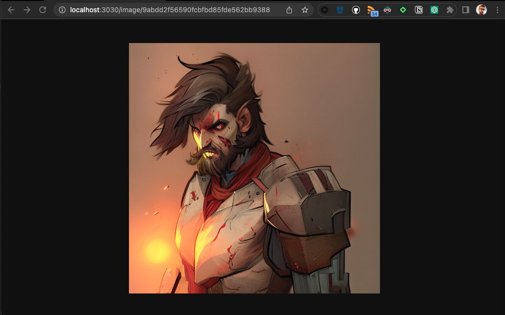
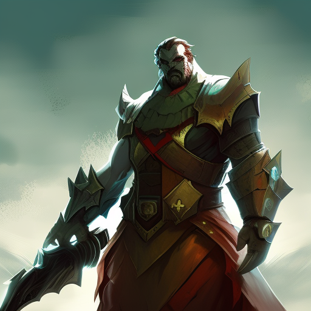

## How to use

### `npm run dev`

Route example:
`http://localhost:3000/image/a2f88584af72fac42f2964371400ceb2`

Image example:  

 

## Docs

[Stability](https://api.stability.ai/docs#tag/v1betageneration/operation/textToImage)

## Useful Links

[Stable Difussion Key](https://beta.dreamstudio.ai/membership?tab=apiKeys) 
[MD5 Hash Generator](https://www.md5hashgenerator.com)
